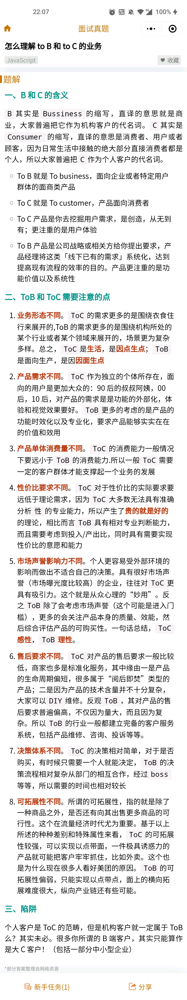
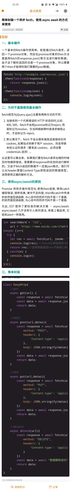
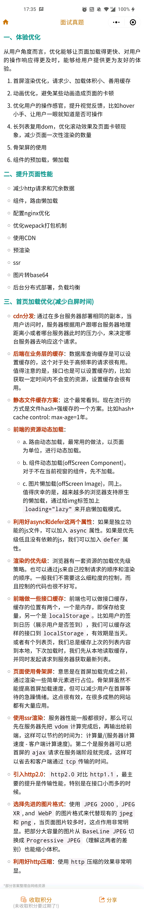

## 不要停下
## git怎么提交单个文件夹和拉取单个文件
> git fetch 
> git checkout -m 版本号 文件名 


### 考察严格模式和非严格模式下的形参区别
来自 https://github.com/lgwebdream/FE-Interview/issues/38
```
function side(arr) {
  arr[0] = arr[2];
}
function a(a, b, c = 3) {
  c = 10;
  side(arguments);
  return a + b + c;
}
a(1, 1, 1);
// 写出执行结果，并解释原因

// 在严格模式下（给形参赋值后就变成严格模式了），形参和arguments没有绑定关系
// 在非严格模式下，形参和arguments绑定了

```

### this ,call,apply,bind
 https://wangdoc.com/javascript/oop/this.html#%E9%81%BF%E5%85%8D%E5%A4%9A%E5%B1%82-this

1. 如何解决 Vue 打包 vendor 过大的问题？Webpack 打包 vue 速度慢怎么办？
    1.1 vue-router 懒加载
    > 原理：把不同路由对应的组件分割成不同的代码块，然后当路由被访问的时候才加载对应组件，这样就更加高效
    > 疑问：这样的方式应该只是在页面加载的过程中使展示的项目快速加载，并没有起到打的包变小吧？
    > ans:（运用懒加载则可以将页面进行划分，需要的时候加载页面，可以有效的分担首页所承担的加载压力，减少首页加载用时。所以并不是减少了打包体积。这里放到解决vue打包bendor体积过大问题这里不合适，应该再加一句，首次响应时间。
    1.2 使用gzip压缩
        a:webpack打包的时候压缩--插件Compression-webpack-plugin
            压缩以后会在目录中生成gz文件，生成gz文件后。在nginx中设置了gzip_static_on后，会加载相应的文件压缩文件，如果找不到，就加载未压缩过的。
        b:浏览器请求js文件的时候，服务器进行压缩
            nginx举例: 
            ![nginx图](./知识汇总/img/1.png）
            gzip的配置，首先是开启gzip，设置缓冲区大小，压缩的等级，需要压缩的文件
    1.3 使用CDN引入资源
    1.4 配置webpack的external，不打包第三方库
    1.5 配置 DllPlugin 和 DllReferencePlugin 将引用的依赖提取 -- https://segmentfault.com/a/1190000016567986

2. 什么是 CSP? 
    > 内容安全策略（CSP）
    > CSP 本质上就是建立白名单，开发者明确告诉浏览器哪些外部资源可以加载和执行。我们只需要配置规    则，如何拦截是由浏览器自己实现的。我们可以通过这种方式来尽量减少 XSS 攻击。
    > 两种方式开启内容安全策略：
    > 1.1 一种是设置 HTTP 首部中的 Content-Security-Policy;
    > 1.2 一种是设置 meta 标签的方式 <meta http-equiv="Content-Security-Policy">

3. 说一下 Vue 中 EventBus（事件总线） 的使用？在使用过程中有没有遇到重复触发的问题？如何解决的？
https://github.com/lgwebdream/FE-Interview/issues/1195

4. Vue 切换路由时，需要保存草稿的功能，怎么实现？
https://github.com/lgwebdream/FE-Interview/issues/1193

5. Vue2.x 为什么要求组件模板只能有一个根元素？
https://github.com/lgwebdream/FE-Interview/issues/1192

6. 你知道 Vue 的模板语法用的是哪个 web 模板引擎的吗？说说你对这模板引擎的理解?
https://github.com/lgwebdream/FE-Interview/issues/1191
补充：了解模板引擎的工作原理      render函数   把vue原理再学一遍

7. 说一下你对 vue keep-alive 的理解？以及使用过程需要注意的地方？
https://github.com/lgwebdream/FE-Interview/issues/1190
补充：了解 组件的 activated 和 deactivated 这两个生命周期钩子函数
*组件使用了keep-alive 会将当前组件缓存，如果数据更新了，可以使用activated生命周期来进行更新，不然数据无法更新*
https://blog.csdn.net/qq_41485414/article/details/113698404

8. 说一下你觉得的 vue 开发规范有哪些？
https://github.com/lgwebdream/FE-Interview/issues/1188

9. 模拟实现 Symbol  (复杂度高)
https://github.com/lgwebdream/FE-Interview/issues/1185

10. 说一下对事件流的理解,如果 addEventListener 的第三个参数设置为 true 会发生什么?
https://github.com/lgwebdream/FE-Interview/issues/1182

11. Reflect.ownKeys 与 Object.keys 的区别
https://github.com/lgwebdream/FE-Interview/issues/1181
补充：为什么obj.keys没有遍历出使用object.defineProperty定义的属性？
答：https://blog.csdn.net/qq_41944936/article/details/118099599   定义属性的时候需要定义是否可枚举。vue绑定数据过程就是使用了这个重新定义所有的data

12. 说一下 vite 和 webpack 对比，为什么 vite 在 dev 模式下运行速度快很多？
https://github.com/lgwebdream/FE-Interview/issues/1180
疑问1：由于 vite 利用的是 ES Module，因此在代码中（除了 vite.config.js 里面，这里是 node 的执行环境）不可以使用 CommonJS ？why。看b站关于es moudles  commondjs AMD 规范讲解
疑问2: HMR机制是什么？原理？ https://www.jianshu.com/p/95f5f51e6fc7
疑问3: webpack的sourceMap  提供开发代码与打包后代码的一个映射关系，方便调试

13. class 的继承和 prototype 继承 是完全一样的吗？
https://github.com/lgwebdream/FE-Interview/issues/1179
es6继承：https://es6.ruanyifeng.com/#docs/class-extends

14. 说一下你对 Get 请求传参长度限制的理解？
https://github.com/lgwebdream/FE-Interview/issues/1202

15. 说下 URL 和 URI 的区别？
https://github.com/lgwebdream/FE-Interview/issues/1201
URL: 统一资源定位器
URI: 统一资源标识符

16. 说下 LRU 算法的原理并手写实现？一般有哪些优化方式？（最近最少使用）

17. js中的运算符逗号，
    > ,逗号表示 代码全部执行，但是只返回最后一个逗号后面的运算表达式的结果

18. Map 数据类型
理解：set每次往后面添加一个，然后利用keys().next()可以取到第一个值（理解为最早插入的值）

19. 如果有一个项目，随着业务的增长越来越大，怎么办，如何来进行一个拆分或者处理
    **工程化**
    首先说下前端工程化的目的：进行高效的多人协作、保证项目的可维护性、提高项目的开发质量、降低项目生产的风险等
    前端工程化是使用软件工程的技术和方法来进行前端的 开发流程、技术、工具、经验等规范化、标准化，其主 要目的为了提高效率和降低成本，即提高开发过程中的开发效率，减少不必要的重复工作时间，而前端工程本 质上是软件工程的一种，因此我们应该从软件工程的角 度来研究前端工程。
    前端工程化就是为了让前端开发能够“自成体系”，个人认为主要应该从模块化、组件化、规范化、动化四个方面思考。
    1. **模块化**
      包括JS的模块化，CSS的模块化，资源的模块化
      简单来说，模块化就是将一个大文件拆分成相互依赖的小文件，在进行统一的拼装和加载
    2. **组件化**
      从UI拆分下来的每个包含模板（HTML）+样式（css）+逻辑（js）功能完备的结构单元，我们称之为组件。
      需要注意的是组件化≠模块化。模块化指示在文件层面上，对代码或资源的拆分，而组件化是在设计层面上对UI（用户界面）的拆分。
      组件化实际上是一种按照模板（HTML）+样式（css）+逻辑（js）三位一体的形式对面向对象的进一步抽象。
      所以我们处了封装组件本身，还要合理处理组件之间的关系，比如（逻辑）继承、（样式）扩展、（模板）嵌套和包含等，这些关系都可以归为依赖。
    3. **规范化**
      目录结构的制定、编码规范、前后端接口规范、文档规范、组件管理、git分支管理、commit描述规范、视觉图标规范
    4. **自动化**
      前端工程化的很多脏活累活都应该交给自动化工具来完成。需要秉持的一个理念是:任何简单机械的重复劳动都 应该让机器去完成。图标合并、持续继承、自动化构建、自动化部署、自动 化测试。

20. 怎么理解 to B 和 to C 的业务


21. 简单封装一个异步 fecth，使用 async await 的方式来使用

    ```
    let searchWord = '123',
        url = `https://www.baidu.com/s?wd=${searchWord}`;
    (async ()=>{
    try {
        let res = await fetch(url, {mode: 'no-cors'});//等待fetch被resolve()后才能继续执行
        console.log(res);//fetch正常返回后才执行
        return res;//这样就能返回res不用担心异步的问题啦啦啦
    } catch(e) {
        console.log(e);
    }
    })();
    ```
    ```
    class EasyHttp{
    //get 
    async get(url) {
        const response = await fetch(url);
        const data = await response.json();
        return data;
    }

    //POST
    async post(url,datas){
        const response = await fetch(url,{
            method: "POST",
            headers: {
                'Content-type': 'application/json'
            },
            body: JSON.stringify(datas)            
        })
        const data = await response.json();
        return data;
    }

    //PUT
    async put(url,datas){
        const response = await fetch(url,{
            method: "PUT",
            headers: {
                'Content-type': 'application/json'
            },
            body: JSON.stringify(datas)            
        })
        const data = await response.json();
        return data;
    }

    //delete
    async delete(url){
        const response = await fetch(url,{
            method: "DELETE",
            headers: {
                'Content-type': 'application/json'
            }
        })
        const data = await "数据删除成功";   //await后面还可以直接跟字符串额 这操作666...
        return data;
    }
}
    ```

22. 给定起止日期，返回中间的所有月份
    ```
    function getMonth(startMonth,endMonth){
        var result = []
        // 转为时间戳
        let sm = getDate(startMonth,1).getTime()
        const em = getDate(endMonth).getTime()
        while(sm<em){
            var curTime = new Date(sm)
            result.push(formatDate(curTime))
            curTime.setMonth(curTime.getMonth()+1)
            sm = curTime.getTime()
        }
        return result
    }

    function getDate(date,addMonth){
    var [year,month] = date.split('-')
    return new Date(year,month-1+addMonth)
    }
    function formatDate(date){
    return `${date.getFullYear()}-${String(date.getMonth()+1).padStart(2,0)}`
    }
    ```

23. 平时在项目开发中都做过哪些前端性能优化


24. 写一个通用的事件侦听器函数
```
MyEvent = {
  // 页面加载完成后
  readyEvent: function (fn) {
    if (fn == null) {
      fn = document;
    }
    var oldOnload = window.onload;
    if (typeof window.onload != "function") {
      window.onload = fn;
    } else {
      window.onload = function () {
        oldOnload();
        fn();
      };
    }
  },
  // 视能力分别使用dom0||dom2||IE方式 来绑定事件
  // 参数： 操作的元素,事件名称 ,事件处理程序
  addEvent: function (element, type, handler) {
    if (element.addEventListener) {
      //事件类型、需要执行的函数、是否捕捉
      element.addEventListener(type, handler, false);
    } else if (element.attachEvent) {
      element.attachEvent("on" + type, function () {
        handler.call(element);
      });
    } else {
      element["on" + type] = handler;
    }
  },
  // 移除事件
  removeEvent: function (element, type, handler) {
    if (element.removeEventListener) {
      element.removeEventListener(type, handler, false);
    } else if (element.datachEvent) {
      element.detachEvent("on" + type, handler);
    } else {
      element["on" + type] = null;
    }
  },
  // 阻止事件 (主要是事件冒泡，因为IE不支持事件捕获)
  stopPropagation: function (ev) {
    if (ev.stopPropagation) {
      ev.stopPropagation();
    } else {
      ev.cancelBubble = true;
    }
  },
  // 取消事件的默认行为
  preventDefault: function (event) {
    if (event.preventDefault) {
      event.preventDefault();
    } else {
      event.returnValue = false;
    }
  },
  // 获取事件目标
  getTarget: function (event) {
    return event.target || event.srcElement;
  },
  // 获取event对象的引用，取到事件的所有信息，确保随时能使用event；
  getEvent: function (e) {
    var ev = e || window.event;
    if (!ev) {
      var c = this.getEvent.caller;
      while (c) {
        ev = c.arguments[0];
        if (ev && Event == ev.constructor) {
          break;
        }
        c = c.caller;
      }
    }
    return ev;
  },
};
```